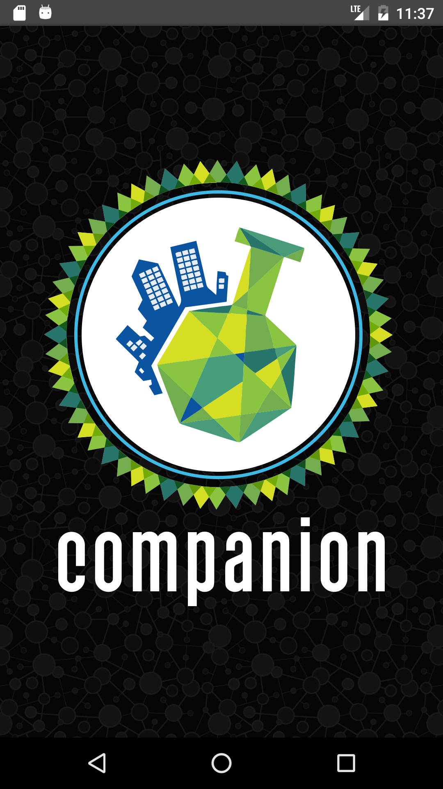
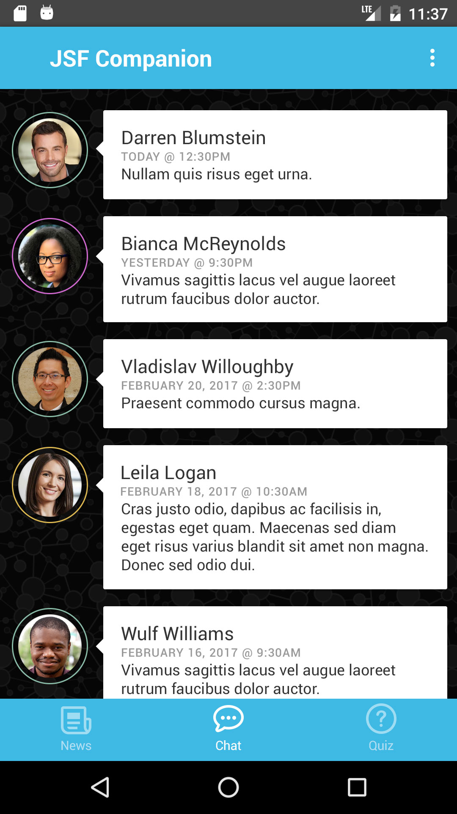

JAX Science Festival App
========================

A basic Android app I made a couple years ago for a UI design class - implements the bottom navigation bar and uses some very simple AI concepts for randomly generated news events and chat bots. The below screen mocks were designed by the best Creative Director I've ever worked with - thanks Zac!!

Umm... Other details... This app uses Icepick for data caching and Jake Wharton's Butterknife for view binding. There's a few other dependencies in there, but I wrote this a long time ago. Avoid the `RefactorExperimentGoneWrong` directory... I forgot what I was attempting to do, and I had a gazillion file changes that I just `git stash'd` locally to roll everything back.

License
-------

    ¯\_(ツ)_/¯
    Written by Kevin Schanz?